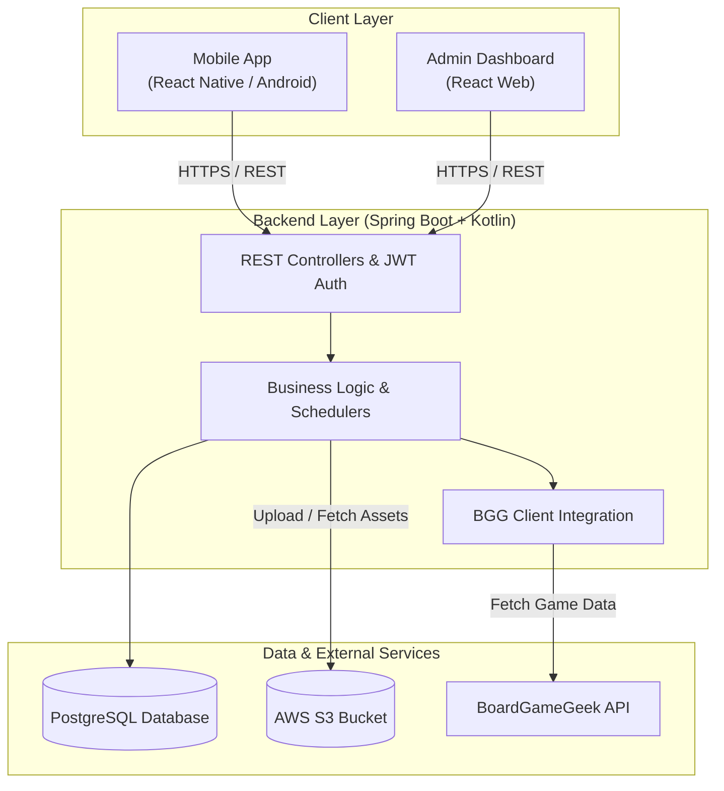

# Let's Table

A personal board-game tracking app for a private group of friends - collection, wishlists, play sessions, and friend management

## Table of Contents

- [Overview](#overview)
- [Architecture](#architecture)
  - [High-Level System Overview](#high-level-system-overview)
  - [Key Technical Components](#key-technical-components)
- [How to Run](#how-to-run)
  - [Prerequisites](#prerequisites)
  - [Clone the Repository](#clone-the-repository)
  - [Run the Backend Service](#run-the-backend-service)
    - [Configure the Environment Variables](#configure-the-environment-variables)
    - [Run the Docker Compose for Local Development](#run-the-docker-compose-for-local-development)
    - [Run the Backend](#run-the-backend)
  - [Run the Mobile Frontend](#run-the-mobile-frontend)
    - [Configure Environment Variables](#configure-environment-variables)
    - [Install Dependencies](#install-dependencies)
    - [Launch the Application](#launch-the-application)
  - [Run the Web Admin Frontend](#run-the-web-admin-frontend)
    - [Configure Environment Variables](#configure-environment-variables-1)
    - [Install Dependencies](#install-dependencies-1)
    - [Launch the Application](#launch-the-application-1)
- [Tests](#tests)
- [Backlog](#backlog)

## Overview

Let's Table is a board game companion app for a small, private friend group - the kind of thing a BoardGameGeek power user and their regular game night crew would actually use day to day: track who owns what, what everyone wants next, who's won the most, and what you played last Tuesday. It is not a general-audience product; it is built and seeded for a known, closed set of users (friends, added via friend requests, not public discovery).

## Architecture

The application follows a decoupled client-server architecture. The mobile application and web administration dashboard communicate with a centralized Spring Boot backend, which handles core business logic, database persistence, media storage, and third-party API integrations.

### High-Level System Overview



### Key Technical Components

- **Frontend Clients:**
  - **React Native (Android App):** Serves end-users for managing game collections, wishlists, match tracking, and social interactions.
  - **React (Web Admin):** Provides administrators with management tools for users, system stats, and global board game data.

- **Backend Service (Spring Boot + Kotlin):**
  - **REST API Layer:** Exposes endpoints using standard Controllers, DTOs, and JPA Specifications for flexible queries.
  - **Authentication & Security:** Uses stateless **JWT (JSON Web Tokens)** with custom security filters (`JwtAuthFilter`) and role-based access control (User vs. Admin).
  - **Integrations & Services:**
    - `BggClient` for fetching board game information and hotness rankings directly from BoardGameGeek.
    - Automated background tasks via `HotGamesScheduler` to keep game data up-to-date.
    - `StorageService` for managing image uploads (e.g., user avatars, game assets) stored in **AWS S3**.

- **Data Layer:**
  - **PostgreSQL:** Primary relational database storing user profiles, friendships, collections, match records, and game statistics.
  - **AWS S3:** Cloud storage for game files and user avatar images.

## How to Run

Follow these instructions to get a local copy of the project up and running on your development machine.

### Prerequisites

Ensure you have the following tools installed before proceeding:

- **Backend:**
  - Java JDK 21 or higher
  - Docker & Docker Compose (recommended for local PostgreSQL and S3 emulation)

- **Frontend Mobile:**
  - Node.js (24+) and npm/pnpm
  - Android Studio & Android SDK (for running the Android emulator)

- **Frontend Web:**
  - Node.js (v24+) and npm/pnpm

### Clone the Repository

```bash
git clone https://github.com/StefanoGaspardone/LetsTable.git
```

### Run the Backend Service

#### Configure the Environment Variables

The backend can be configured using environment variables (or an `.env` file). Variables defined as **Required** must be explicitly provided in your environment, while **Optional** variables have a pre-configured default fallback value.

| Variable Name | Required | Default / Fallback Value | Description |
| :--- | :---: | :--- | :--- |
| **Database & System** | | | |
| `SPRING_PROFILES_ACTIVE` | ❌ Optional | `dev` | Active Spring profile. |
| `PORT` | ❌ Optional | `8080` | Port on which the Spring Boot server runs. |
| **Email Service (Brevo)** | | | |
| `MAIL_FROM_ADDRESS` | ❌ Optional | `noreply@letstable.com` | Sender email address for outgoing system emails. |
| `MAIL_ENABLED` | ❌ Optional | `true` | Enables or disables email notification sending. Usually, this is set to `false` in development and `true` in production. |
| `BREVO_API_KEY` | ⚠️ **Required** | *None* | API Key for transactional email service. In production, this should be a secure, generated key, from Brevo. |
| **Security & Authentication** | | | |
| `JWT_SECRET` | ❌ Optional | `59e01dfd...` | Secret key used to sign JWT tokens. You are encouraged to generate a new, secure key for production use. |
| **External Integrations** | | | |
| `BGG_API_TOKEN` | ⚠️ **Required** | *None* | API Token for BoardGameGeek API integration. |
| **S3 Storage / Object Storage** | | | |
| `S3_URL` | ❌ Optional | `http://localhost:9000` | S3 endpoint URL (defaults to local MinIO). |
| `S3_ACCESS_KEY` | ❌ Optional | `minioadmin` | S3 Access Key. |
| `S3_SECRET_KEY` | ❌ Optional | `minioadmin` | S3 Secret Key. |
| `S3_BUCKET` | ❌ Optional | `uploads` | Target bucket name for uploads. |
| `S3_REGION` | ❌ Optional | `eu-central-1` | S3 Region. |
| **CORS Configuration** | | | |
| `CORS_ALLOWED_ORIGINS` | ❌ Optional | `http://localhost:5173` | Allowed origins for CORS requests. Without this, the frontend admin application will not be able to make cross-origin requests. |
| **Database Seeding** | | | |
| `SEEDING_ENABLED` | ❌ Optional | `false` | Enables database seeding on startup. Set to `false` in production. |
| `SEEDING_ADMIN_USERNAME` | ❌ Optional | `admin` | Default admin username created during seeding. |
| `SEEDING_ADMIN_EMAIL` | ❌ Optional | `admin@letstable.com` | Default admin email created during seeding. |
| `SEEDING_ADMIN_PASSWORD` | ❌ Optional | `admin123` | Default admin password created during seeding. |

To properly configure the backend, you can create a `application.properties` file in the root directory of the backend project and populate it with the required variables. For example:

```bash
# application.properties
SPRING_PROFILES_ACTIVE=dev

JWT_SECRET=your_secure_jwt_secret_key_here

DATABASE_URL=your_database_url_here
DATABASE_USERNAME=your_database_username_here
DATABASE_PASSWORD=your_database_password_here

MAIL_FROM_ADDRESS=your_email_address_here
MAIL_ENABLED=true|false
BREVO_API_KEY=your_brevo_api_key_here

BGG_API_TOKEN=your_bgg_api_token_here

SEEDING_ENABLED=true
SEEDING_ADMIN_USERNAME=your_admin_username_here
SEEDING_ADMIN_EMAIL=your_admin_email_here
SEEDING_ADMIN_PASSWORD=your_admin_password_here

S3_URL=your_s3_endpoint_here
S3_ACCESS_KEY=your_s3_access_key_here
S3_SECRET_KEY=your_s3_secret_key_here
S3_BUCKET=your_s3_bucket_name_here
S3_REGION=your_s3_region_here

PORT=8080

CORS_ALLOWED_ORIGINS=your_frontend_origin_here
```

Moreover, set up a `gradle.properties` file in the root directory of the backend project to define the flyway migration configuration for Gradle:

```bash
flywayUrl=your_database_url_here (must match the DATABASE_URL in application.properties)
flywayUser=your_database_username_here (must match the DATABASE_USERNAME in application.properties)
flywayPassword=your_database_password_here (must match the DATABASE_PASSWORD in application.properties)
```

### Run the Docker Compose for Local Development

Before launching the backend, you need to spin up the required infrastructure services (e.g., PostgreSQL database and MinIO for local S3 storage) using Docker Compose.

1. Navigate to the directory containing the `docker-compose.yml` file

    ```bash
    cd docker/letstable
    ```

2. Create a `.env` file in the same directory as your `docker-compose.yml` to set custom credentials, or rely on the predefined local defaults.

    | Docker Variable | Required | Default / Fallback Value | Connected Backend Property | Description |
    | :--- | :---: | :--- | :--- | :--- |
    | **PostgreSQL** | | | | |
    | `POSTGRES_USER` | ❌ Optional | `letstable_user` | `SPRING_DATASOURCE_USERNAME` | Database user. Must match the backend datasource username. |
    | `POSTGRES_PASSWORD` | ❌ Optional | `letstable_pass` | `SPRING_DATASOURCE_PASSWORD` | Database password. Must match the backend datasource password. |
    | `POSTGRES_DB` | ❌ Optional | `letstable_db` | `SPRING_DATASOURCE_URL` | Database name (e.g., `jdbc:postgresql://localhost:5432/letstable_db`). |
    | **PgAdmin** | | | | |
    | `PGADMIN_EMAIL` | ❌ Optional | `admin@letstable.com` | N/A | Admin email to access PgAdmin dashboard (`http://localhost:5050`). |
    | `PGADMIN_PASSWORD` | ❌ Optional | `admin_letstable` | N/A | Password to access PgAdmin dashboard. |
    | **MinIO (S3 Storage)** | | | | |
    | `MINIO_ROOT_USER` | ❌ Optional | `minioadmin` | `S3_ACCESS_KEY` | MinIO Access Key. Must match the backend S3 access key. |
    | `MINIO_ROOT_PASSWORD` | ❌ Optional | `minioadmin` | `S3_SECRET_KEY` | MinIO Secret Key. Must match the backend S3 secret key. |

3. Start all services in detached mode:

    ```bash
    docker compose up -d
    ```

### Run the Backend

1. Navigate to the backend project directory:

    ```bash
    cd backend
    ```

2. Build and run the Spring Boot application:

    ```bash
    ./gradlew bootRun
    ```

3. The backend service should now be running at `http://localhost:<your_configured_port>`, also you can see the ip address of the service running on the local network. You can verify the health of the service by accessing the health endpoint:

    ```bash
    curl http://localhost:8080/api/v1/health
    ```

    Also, a full API documentation is available at the `/swagger-ui.html` endpoint of the service.

## Run the Mobile Frontend

The mobile app is built using React Native and targets Android devices.

### Configure Environment Variables

Navigate to the mobile frontend directory and set up your local environment file:

```bash
cd frontend-mobile
```

Create a `.env.local` file in the root of the frontend-mobile directory with your local backend URL:

```env
EXPO_PUBLIC_API_URL=<your_backend_url>/api/v1
EXPO_PUBLIC_TERMS_URL=<your_backend_url>/terms.html
```

### Install Dependencies

Install the required npm packages using your preferred package manager (`pnpm` or `npm`):

```bash
pnpm install
# or
npm install
```

### Launch the Application

Make sure you have an Android Virtual Device (AVD) running in Android Studio or a physical device connected, run:

```bash
pnpm dev
# or
npm dev
```

and then, simply follow the instructions provided by Expo on the terminal to open the app on your device or emulator.

### Run the Web Admin Frontend

The web admin dashboard is built using React and can be run locally for development purposes.

#### Configure Environment Variables

Navigate to the web admin frontend directory:

```bash
cd frontend-admin
```

Create a .env file in the root of the frontend-admin directory with your local backend URL:

```env
VITE_SERVER_URL=<your_backend_url>/api/v1
```

#### Install Dependencies

Install the required npm packages using your preferred package manager (`pnpm` or `npm`):

```bash
pnpm install
# or
npm install
```

#### Launch the Application

Run the web admin frontend:

```bash
pnpm dev
# or
npm dev
```

The web admin dashboard should now be accessible at `http://localhost:5173` (or the port specified in your environment). Remember to set this address in the `CORS_ALLOWED_ORIGINS` variable of your backend configuration to allow cross-origin requests.

## Tests

## Backlog

- friend section in create match
- edit match
- fix push notifications
- games with only 1 team, win o not
- friends section of a user
